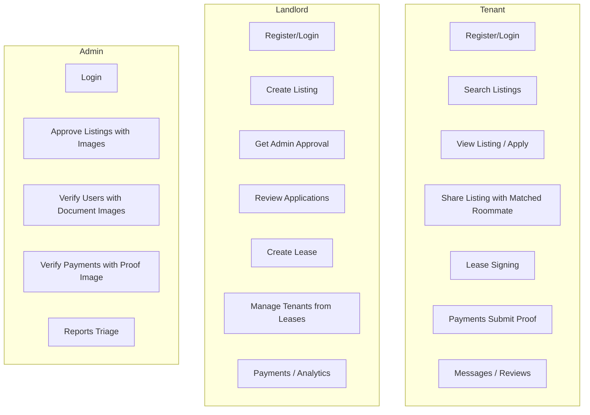

# Roombay Testing Plan (Revised Scope)

**Aligned with:** [REVISED-SCOPE-MVP.md](REVISED-SCOPE-MVP.md) and [PRODUCT-BACKLOG.md](PRODUCT-BACKLOG.md)

**Changes from original:** Household removed, disputes removed, co-apply simplified to share-with-roommate, tenant verification generalized, admin payment proof viewing added.

---

## Current State

- **Backend**: Spring Boot 3.5.7, JUnit 5, Mockito, spring-security-test. Only 3 tests exist.
- **Frontend**: Next.js 16, no test framework.
- **Infra**: PostgreSQL, Elasticsearch, Redis, WebSockets. No Testcontainers.

---

## User Personas and Journeys (Revised)

**Removed from MVP:** Household, Disputes, Co-apply (replaced with share-with-roommate)

---

## Phase 1: Unit Tests

### Backend (Priority Services)

| Service | Test Focus | File |
|---------|------------|------|
| AuthService | Register, login, JWT, password reset | `AuthServiceTest.java` |
| ApplicationService | Submit, review, withdraw; state transitions | `ApplicationServiceTest.java` |
| LeaseService | Create lease, sign, terminate, complete | `LeaseServiceTest.java` |
| PaymentService | Initiate, submit proof, status transitions | `PaymentServiceTest.java` |
| ListingService | CRUD, search, favorites, status (DRAFT→PENDING→ACTIVE) | `ListingServiceTest.java` |
| VerificationService | Submit, approve, reject (tenant + landlord) | `VerificationServiceTest.java` |
| InputSanitizer | XSS, injection, bounds | `InputSanitizerTest.java` |

### Frontend (New Setup)

- Add **Vitest** + **React Testing Library**
- Test: auth-context, api interceptors, form validation, listing normalization

---

## Phase 2: Integration Tests

| Controller | Test Focus | Approach |
|------------|------------|----------|
| AuthController | POST /register, /login, /refresh | MockMvc |
| ListingController | CRUD, search, favorites | `@WebMvcTest` or full |
| ApplicationController | Submit application, landlord review | Full integration |
| LeaseController | Create lease, sign | Full integration |
| SearchController | Search with ES fallback | Mock ES |
| AdminController | Approve listing, verify user, verify payment | `@WithMockUser(roles="ADMIN")` |

**Admin payment verification:** Ensure API returns `paymentProofUrl` for admin to view proof.

---

## Phase 3: E2E Journeys (Revised)

### Tenant Journey

| # | Journey | Steps | Assertions |
|---|---------|-------|------------|
| 1 | Register and onboard | Register → verify email → onboarding → preferences | Redirect to for-you, preferences saved |
| 2 | Search and apply | Search → filter → view listing → apply | Application created, landlord sees it |
| 3 | Share listing with roommate | View listing → share with matched roommate | Roommate receives notification/link |
| 4 | Lease signing | View lease → sign → confirm | Lease status ACTIVE |
| 5 | Payment submission | Initiate payment → upload proof → submit | Status SUBMITTED, admin sees proof |

**Removed:** Co-apply flow, Household + payments (household removed)

### Landlord Journey

| # | Journey | Steps | Assertions |
|---|---------|-------|------------|
| 1 | Create listing | Login → new listing → fill form → submit | Listing PENDING, admin sees it |
| 2 | Listing approval | Admin approves → landlord sees ACTIVE | Listing visible in search |
| 3 | Application to lease | Receive application → approve → create lease | Lease created, tenant notified |
| 4 | Tenant management | View tenants → lease details | Tenants derived from leases correctly |
| 5 | Payments and analytics | View payments per lease, view analytics | Payment status, view/application counts |

### Admin Journey

| # | Journey | Steps | Assertions |
|---|---------|-------|------------|
| 1 | Approve listing | Login → pending listings → view images → approve | Listing ACTIVE, images visible |
| 2 | Verify user | Pending verifications → view ID/selfie images → approve/reject | User status updated, images visible |
| 3 | Payment verification | Pending payments → view proof image → verify/reject | Payment status updated, proof visible |
| 4 | Reports triage | View report → set status/priority | Report updated |
| 5 | Reindex search | Settings → Reindex Search | Index count increases |

**Removed:** Disputes management

---

## Phase 4: Performance, Load, Stress

- **Performance:** `GET /api/search`, `GET /api/listings`, `POST /api/auth/login` &lt; target p95
- **Load:** 50–100 concurrent users, read-heavy mix
- **Stress:** Ramp to find breaking point

---

## Test Alignment with Backlog

| Backlog Item | Test Coverage |
|--------------|---------------|
| P0-1 Admin payment proof | E2E Admin #3, AdminController IT |
| P0-2 Admin user verification images | E2E Admin #2, VerificationServiceTest |
| P0-3 Landlord tenant accuracy | E2E Landlord #4, LeaseServiceTest |
| P1-1 Tenant verification generalized | VerificationServiceTest, E2E |
| P1-2 Share with roommate | E2E Tenant #3 |
| P1-3 Household removed | No household E2E; verify nav removed |
| P1-4 Landlord payments | E2E Landlord #5, PaymentServiceTest |
| P1-5 Landlord analytics | E2E Landlord #5, AnalyticsController IT |

---

## Implementation Order

| Phase | Scope | Est. Effort |
|-------|-------|-------------|
| 1a | Backend unit tests (7 services) | 2–3 days |
| 1b | Frontend Vitest setup + auth/api tests | 1 day |
| 2a | Integration tests (Auth, Listing, Search) | 2 days |
| 2b | Application/Lease integration + Admin payment proof | 1–2 days |
| 3 | Playwright setup + revised E2E journeys | 2–3 days |
| 4 | k6/JMeter scripts + performance baseline | 1–2 days |

---

## Key Files

| File | Purpose |
|------|---------|
| `backend/src/test/resources/application-test.properties` | Test profile |
| `backend/src/test/java/.../service/*ServiceTest.java` | Unit tests |
| `backend/src/test/java/.../controller/*ControllerIT.java` | Integration tests |
| `frontend/package.json` | Add vitest, @testing-library/react, playwright |
| `frontend/e2e/*.spec.ts` | E2E specs |
| `scripts/k6/search-load.js` | k6 load script |
